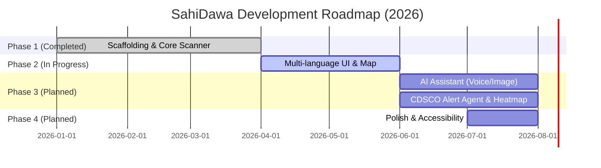

# SahiDawa — Architecture & Project Overview

SahiDawa is an open-source **medicine verification and rural health assistant** aimed at Indian citizens (especially in rural areas) to combat counterfeit drugs and lack of healthcare access. It lets users *scan medicines*, verify authenticity, find nearby trusted pharmacies, and even interact with an AI health assistant in local languages. The platform is built as a **Next.js/Tailwind PWA frontend** with a **Node.js/Express API** backend (using PostgreSQL+PostGIS via Supabase and Redis caching) and a **Python FastAPI ML microservice** (for voice/image processing). Current work has scaffolded the core features (home dashboard, scanner, voice, and map pages in the UI) and basic backend scaffolding; much of the business logic (API routes, ML models, database seed data) remains to be implemented.

- **Problem Statement:** India has a serious counterfeit-medical problem (up to 12–25% fake drugs) and a rural doctor shortage. There is no citizen-facing solution to verify medicines, and rural users speak diverse languages with low-bandwidth internet. SahiDawa addresses this by letting users verify drug barcodes against official (CDSCO) data, report fakes, consult a multilingual AI doctor, and locate certified pharmacies – all offline-capable and free.  

- **Target Users:** Primarily rural Indian citizens and patients with limited English proficiency. Also health volunteers (ASHA workers) and NGOs can use its pharmacy mapping and alert features.  

- **Goals:** Build a **free, offline-friendly** platform for medicine authentication (via barcode scanning + image analysis) and health guidance (via a multilingual AI assistant). All features are open-source and crowd-driven, with no ads or data selling.

## Architecture & Approach

```mermaid
flowchart TD
    U[User (Patient/Rural Citizen)] -->|Scan Barcode/Voice| Web[Next.js PWA Client]
    Web -->|API call (REST)| API[Node.js/Express API]
    API -->|Query/Verify| DB[(Supabase PostgreSQL)]
    API -->|Cache| Cache[(Redis Cache)]
    Web -->|Upload Image/Voice| ML[Python FastAPI (ML Service)]
    ML -->|Voice ASR| Whisper[Whisper ASR]
    ML -->|Image Classifier| CV[OpenCV / TF Lite]
    ML -->|Triage Q&A| LLM[Sarvam AI / LangChain]
    LLM -->|Send Answer| API
    Poller[LangChain CDSCO Poller] -->|Fetch Recalls| CDSCO[CDSCO Drug Portal]
    Poller -->|Update Database| DB
```

- **Monorepo Structure:** The code lives in one repository using NPM workspaces. Key directories are: `apps/web/` (Next.js frontend), `apps/api/` (Express backend), and `apps/ml/` (Python ML service). A `packages/shared/` folder is reserved for common code (currently empty).
- **Data Flow:** The **PWA client** handles the UI for scanning, voice input, and maps. It calls the **Express API** for verification and uses **Supabase (Postgres + PostGIS)** as the primary datastore. User-uploaded images or audio are forwarded to the **FastAPI ML service**: voice goes through Whisper ASR, images through OpenCV/TF-Lite, and text queries through an Indian LLM (Sarvam AI) via LangChain. A background LangChain agent periodically scrapes the government CDSCO portal for drug alerts and updates the DB.
- **Key Components:** 
  - **Frontend (Next.js 16, React 19)** with Tailwind v4 and shadcn/ui components. Uses Workbox for offline caching and ZXing for in-browser barcode scanning. The UI is designed for light/dark themes for different pages.
  - **Backend (Node.js 22, Express 5, TypeScript)** with Supabase client for DB access and Redis (Upstash) for caching drug-lookups. No sensitive keys are exposed to the client. 
  - **ML Service (Python, FastAPI)** for AI features (speech-to-text and image analysis). Uses Pydantic models and uvicorn server.
  - **Database:** PostgreSQL with PostGIS (for geo queries) and pgvector (for future embeddings) managed by Supabase. The schema includes `medicines`, `pharmacies`, and `counterfeit_reports` tables.
  - **Integrations:** Whisper (speech), OpenCV.js/TensorFlow-Lite (image), Sarvam AI LLM, LangChain agent, Cloudinary (image storage/analysis), government APIs (CDSCO, Jan Aushadhi, PMJAY, OSM).
  
## Components & Status

| **Component / Module**            | **Description**                                        | **Status**             |
|----------------------------------|--------------------------------------------------------|-----------------------|
| **Home Dashboard (Next.js)**     | Landing page with hero, features, navigation.          | ✅ Implemented (static) |
| **Medicine Scanner UI**          | Barcode/QR scanner and upload interface.               | ✅ Implemented (mock camera + upload) |
| **Voice Assistant UI**          | Microphone interface and language selection.           | ✅ Implemented (mock) |
| **Pharmacy Map UI**              | Leaflet map showing pharmacies/ASHA (mock data).       | ✅ Implemented (static mock) |
| **Custom Error/404 Pages**       | App-wide error and loading boundaries.                 | ☐ *Missing (templates empty)* |
| **Supabase DB Client**           | Singleton for Postgres/PostGIS access (TypeScript).    | ✅ Ready |
| **Express Server**              | Entry point (`src/index.ts`) with health endpoint.     | ✅ Scaffolded (only GET / and /health) |
| **API Routes & Services**        | Endpoints for verify, pharmacies, reports, etc.        | ⚠️ *Not yet implemented* (routes folder empty) |
| **Redis Cache**                 | Caching layer for drug lookups.                        | ✅ Library added (Upstash); usage not yet coded. |
| **ML Service (FastAPI)**         | Endpoints for OCR/ASR/RAG.                             | ✅ Scaffolded (`main.py` exists) |
| **ML Routers & Models**          | Whisper transcription, TF-Lite classifier, LangChain.  | ⚠️ *Empty* (to be developed) |
| **Pharmacy Data (PostGIS)**      | Stores Jan Aushadhi pharmacies (with geocoords).       | ✅ Schema defined; data import pending. |
| **Counterfeit Reports (PWA)**    | UI/forms to report fake drugs, and map heatmap.        | ⚠️ *Planned* (UI placeholders exist) |
| **Offline PWA**                 | Caching strategy for no-net usage (Workbox).           | ⚠️ *Planned* (architected) |
| **Documentation & i18n**         | English content in place; 22-language support planned. | ⚠️ *Partial* (English UI done; i18n folder present but mostly empty) |

## Data Models & APIs

- **Database Schema:** See [schema.sql](https://github.com/RatLoopz/sahidawa-india/blob/main/apps/api/src/db/schema.sql). Key tables are:
  - `medicines` (CDSCO drug catalog): fields like `barcode_id`, `brand_name`, `generic_name`, `manufacturer`, `cdsco_approval_status`, etc..
  - `pharmacies`: stores Jan Aushadhi drugstore info with `location` (PostGIS `POINT`) for geo queries.
  - `counterfeit_reports`: links to `medicines`, stores `scanned_barcode`, optional `photo_url` (Cloudinary), `report_location` (geo), `status` (‘pending’, ‘verified_fake’, etc.).
- **PostGIS Use:** The codebase map even shows a sample geo-query: finding pharmacies within 5km of a point. This suggests planned location-based features for mapping nearby resources.
- **APIs (Planned):** While only a health check exists now, the intended REST endpoints include:
  - **POST /api/verify** – verify a scanned barcode against `medicines` (return drug info or alert).
  - **GET /api/pharmacies** – list pharmacies near a location (using PostGIS).
  - **POST /api/reports** – submit a counterfeit drug report (saving into `counterfeit_reports`).
  - The API will return JSON (success flag and data) and use proper HTTP codes.
  - An OpenAPI/Swagger docs endpoint is planned at `/api-docs` (mentioned in README).
- **Shared Code:** There is a `packages/shared/` folder for common types (currently empty), and frontend uses a `lib/api.ts` utility for fetch calls (to be filled).

## Implementation Status

Overall, **the code is a work-in-progress**. The repository has solid scaffolding and design docs, but most core functionality is incomplete:

- **Frontend:** Pages exist as React components with Tailwind styles. The scanner page uses a state-machine pattern and mock timeouts to simulate scanning. The voice page has a mock UI with placeholder waveform. However, none of these pages actually fetch real data yet. Key frontend parts still empty: reusable components (e.g. `<Scanner />`, map markers) and hooks (`useScanner`, `useVoice`).
  
- **Backend:** The Express app has minimal code (`GET /` and `/health`). The Supabase client is set up, and the database schema is defined, but **no service functions or routes** for lookup are implemented. The `src/routes` and `src/services` folders are empty. This means: **verifying a medicine barcode currently does nothing**. There are no seed data imports yet (the `data/seeds/` folder is empty).

- **ML Service:** Only `main.py` exists with CORS enabled; no routers (e.g. `/voice`, `/ocr`) or model code is present. The requirements (`fastapi`, `uvicorn`, etc.) are listed, but actual Whisper or TensorFlow code is missing.

- **Deployments:** Frontend deploys via Vercel (free) and backend on Railway (free tier) as per docs. No live instance is linked, so it’s unclear if anything is deployed yet. Docker Compose files (`docker-compose.yml`) exist, suggesting a path to full-stack local deployment.

- **Testing/CI:** A GitHub Actions CI workflow (`test.yml`) is present but likely unconfigured (no tests exist). Codebase map notes that CI pipeline is needed. Issue templates and PR templates are in place, indicating an active contribution workflow, but no automated quality checks beyond linting are set.

## Build, Deployment, and Run

The **README and docs provide clear setup instructions**:

- **Prerequisites:** Node.js ≥20 and Python ≥3.10 (plus Docker for full-stack).
- **Quick Frontend Dev:**  
  ```bash
  git clone https://github.com/RatLoopz/sahidawa-india.git
  cd sahidawa-india/apps/web
  npm install
  cp .env.example .env.local  # set SUPABASE_URL and anon key
  npm run dev
  ```  
  This starts Next.js on `localhost:3000`.
- **Full-Stack (Docker):** Using the provided `docker-compose.yml`, one can launch all services:
  ```bash
  cp .env.example .env   # fill in credentials (Supabase keys, DB URL, etc.)
  docker compose up --build
  ```  
  After startup: frontend at http://localhost:3000, API at http://localhost:4000, ML service at http://localhost:8000, and Swagger docs at `/api-docs`.
- **Manual Backend Dev:**  
  ```bash
  cd sahidawa-india/apps/api
  npm install
  npm run dev   # starts Express server (default port 4000)
  
  cd ../ml
  python -m venv venv
  source venv/bin/activate    # Windows: venv\Scripts\activate
  pip install -r requirements.txt
  uvicorn main:app --reload --port 8000
  ```  
  This runs the Node API and the FastAPI ML service locally.
  
**Deployment:** Tech stack notes indicate frontend deploys to Vercel and backend to Railway. It also mentions future use of Lighthouse CI and Docker Compose for production readiness. No public demo URL is given, so deployment may still be in progress.

## Libraries, Frameworks, External Services

SahiDawa leverages many modern open-source tools:

- **Frontend:** Next.js 16 (React 19), Tailwind CSS v4, shadcn/ui components. Workbox for PWA caching. ZXing (@zxing/browser) for live barcode scanning in-browser. Leaflet+OpenStreetMap for mapping (no paid map APIs). Next-intl for 22-language support.
- **Backend:** Node.js 22 + Express 5 with TypeScript. Supabase JS library for Postgres access. Redis (Upstash) for caching. Additional middleware planned: Helmet for HTTP headers, Morgan logging. (Code-guide rules mention structured JSON and error handling in Express.)
- **ML/AI:** OpenCV.js and TensorFlow Lite (for image/classifier on device). Whisper (self-hosted) for speech recognition. Sarvam AI (an Indian LLM) for natural-language triage. LangChain in Python for RAG pipeline and the autonomous agent (monitoring CDSCO alerts). The “Sarvam AI” and “LangChain” are explicitly listed in the tech stack.
- **Database & Storage:** PostgreSQL with PostGIS, managed via Supabase (free dev tier). pgvector extension for vector embeddings (to support future RAG queries). Cloudinary for storing medicine photos and using its image analysis capabilities (a GSSoC partner).
- **Other Services:** Government data sources – CDSCO (central drug registry), Jan Aushadhi (generic drug stores), PMJAY hospital locator, OpenStreetMap (via Overpass API) – for seeding medicines, pharmacies, and health content. The project plans to fetch drug monographs from India’s National Health Portal for the AI assistant.

## Security, Scalability, Performance

- **Security:** The code uses industry best practices (Express 5 async error handling, structured JSON errors). The Supabase RLS (Row-Level Security) pattern is followed (public read on medicines, auth-protected writes on reports) to protect data access. Sensitive keys (like the Supabase service key) are kept server-side; the frontend only uses the public anon key. Helmet (for secure HTTP headers) and rate-limiting middleware are planned. User uploads (photos/voice) go through controlled endpoints (FastAPI’s `UploadFile`).
- **Scalability:** The stack is cloud-native: Next.js and Node apps can scale horizontally (Vercel/Railway). Database is managed (Supabase/Postgres) with PostGIS for efficient geo queries (indexed). Redis caching reduces DB load for repeated lookups. Dockerization ensures consistent deployments. The design to work offline (PWA) also reduces server dependency.
- **Performance:** Use of Tailwind and optimized React SSR should yield fast frontend. Workbox caching helps load content quickly on repeat visits. Express can be horizontally scaled; Postgres can index barcode fields (`idx_medicines_barcode`) and use GiST indexes for geospatial queries (as shown in schema). Planned Lighthouse audits (target 90+ score) and accessibility checks indicate attention to performance and user experience.

## Code Quality & Contribution Workflow

The project is well-documented with **contributing guides, code maps, and style rules**:

- **Documentation:** There are extensive docs under `docs/` – an architecture guide, a code guide (coding conventions), and a codebase map detailing every folder/file. The README itself serves as a high-level overview.
- **Type Safety:** Frontend and backend use TypeScript; Python service uses Pydantic models for requests/responses.
- **Linting/CI:** A GitHub Actions workflow for CI/tests is included (`SahiDawa CI / Test Suite`), though no tests are written yet. Linters (ESLint, Prettier) are expected. 
- **Issue/PR Process:** The repo has 40+ issues (with labels like `good-first-issue` for newcomers), plus issue/PR templates under `.github/`. The README’s *Contributing* section outlines how to pick issues and submit PRs. Maintainers aim to review PRs promptly.
- **Open Source:** By design, the project is open source (MIT license) and community-driven. All feature requests and bug reports are done via GitHub Issues. The founders encourage contributions on everything from translations to core AI features.

## Prioritized Roadmap



Our immediate focus centers around these key milestones:

1. **Implement Core Features (Phase 1 Completion):** Finish the barcode scanner functionality. In the API, code the `/verify` endpoint to query `medicines` by `barcode_id` and return results. Populate the database by importing CDSCO data. Complete the Supabase integration so the frontend can query data natively.

2. **Multilingual & Mapping (Phase 2):** Add i18n JSON files for Indian languages and wire up `next-intl` in the client. Integrate Leaflet so the Map page shows real pharmacy data: fetch `pharmacies` from the API, using PostGIS queries to find nearby stores and ASHA workers. Implement the “Pharmacy & ASHA Map” feature using Jan Aushadhi data. Integrate Cloudinary for user-uploaded drug images and set up Workbox strategies for offline caching.

3. **AI Health Assistant (Phase 3):** Develop the FastAPI ML endpoints: 
   - **OCR/ASR:** `/voice` route that accepts an audio file, runs Whisper, and returns text. `/ocr` for extracting text from images.
   - **Image Classifier:** Use TensorFlow Lite to distinguish real vs fake packaging.
   - **RAG QA:** `/ai-triage` route to feed user symptoms into Sarvam AI via LangChain, augmented with NHP (National Health Portal) docs for evidence-based answers.
   - Build the CDSCO agent in LangChain to watch drug recall announcements and flag any affected medicines in DB.

4. **Reporting & Visualization:** Enable users to submit counterfeit reports (upload photo + location). Implement `/reports` endpoint saving to `counterfeit_reports`. Build the counterfeit-heatmap to visualize reports by district. Add push notifications or alerts for newly identified fakes.

5. **Polish & Launch (Phase 4):** Conduct WCAG accessibility testing and performance audits (Lighthouse CI). Finalize Docker Compose for easy deployment. Add complete Swagger/OpenAPI documentation for all APIs. Optionally integrate ABHA e-health ID features prior to public launch.

Throughout these phases, we prioritize writing unit/integration tests and enforcing CI/CD (GitHub Actions) to maintain code quality. Contributions are strongly encouraged to help us hit these milestones and complete the roadmap for GSSoC 2026.